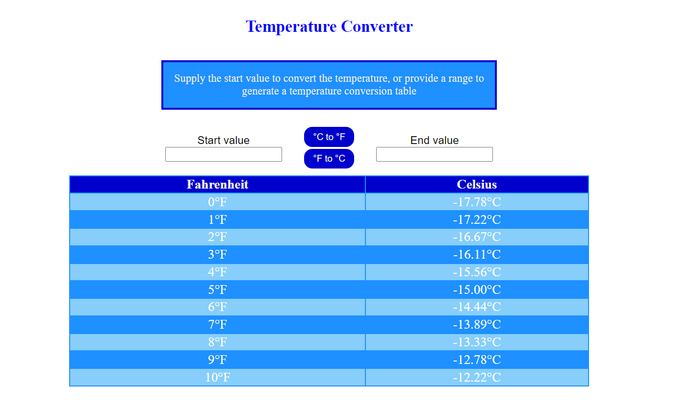

# TemperatureConverter

## This simple Vanilla JavaScript tool can convert from Celsius to Fahrenheit

To run it, clone the project and open DynamicTable.html in the HTML directory.

You can provide start and end values to display a table with every converted temperature in that range. If you wish to convert a singular value, only supply the start value. Two buttons are provided for conversion from C to F and for F to C.

Basic input validation is performed to only accept numeric values. If the start value is left empty, it defaults to 0. Float values are rounded and an alert is displayed notifying the user. 

